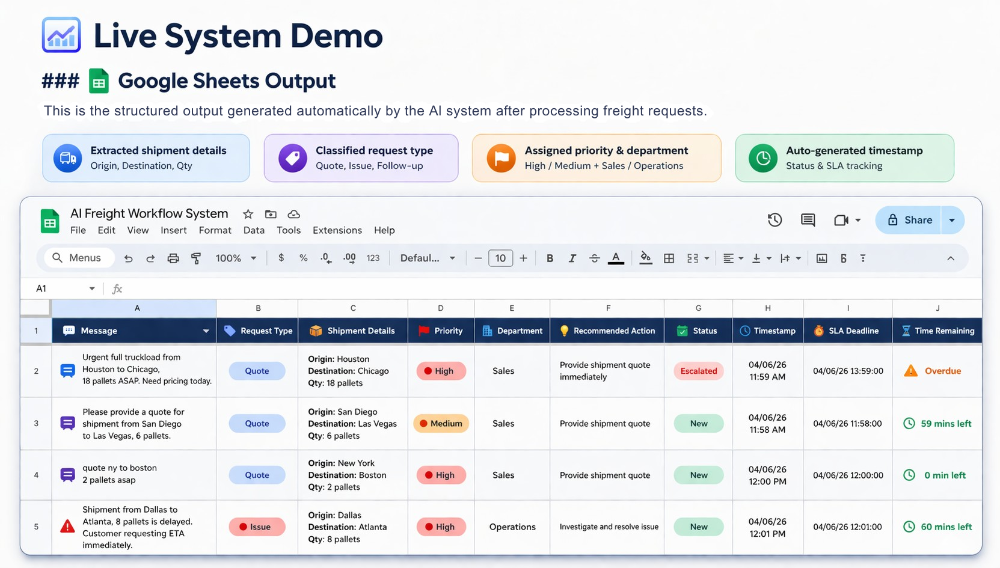
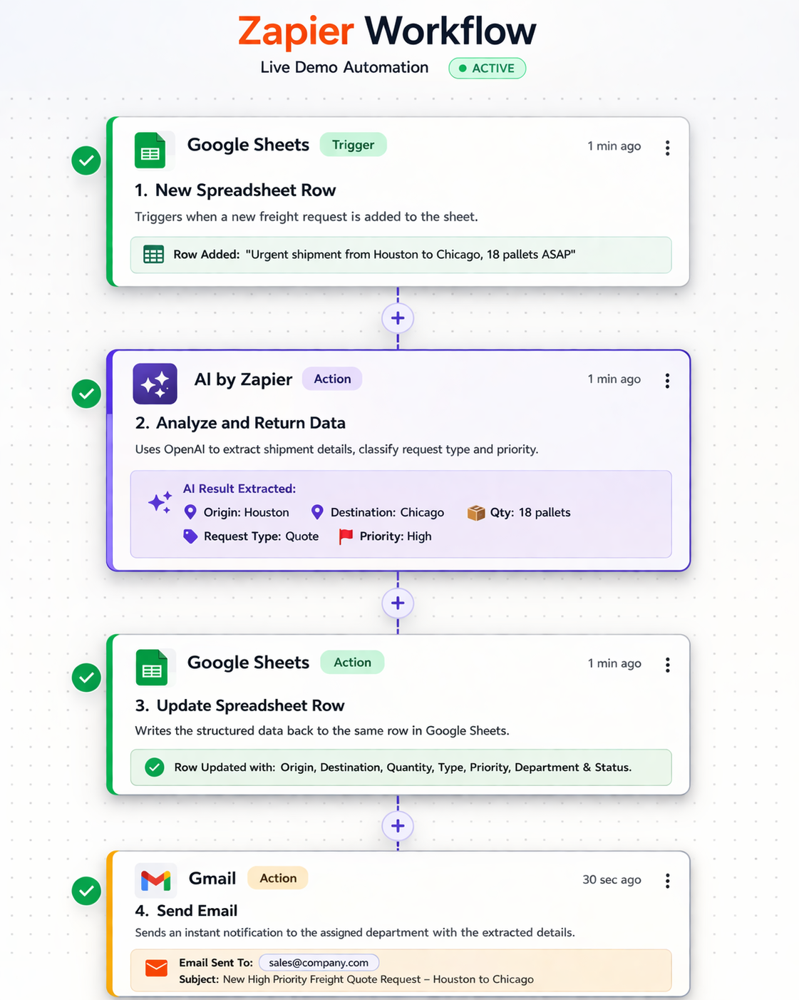
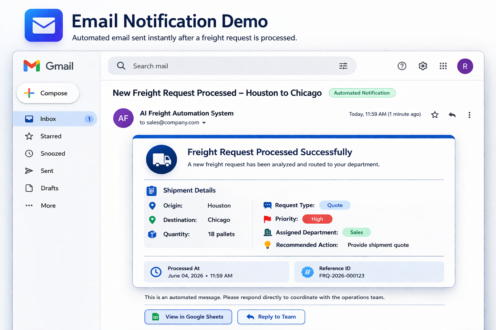

# 🚚 AI Freight Request Automation System

> Automate freight request processing using AI — reduce manual work, speed up response time, and eliminate errors.

---

## 💼 What This System Does

This system automatically processes freight requests from emails or chat messages.

Instead of manually reading and encoding requests, the system:

- Extracts shipment details  
- Classifies request type  
- Assigns priority  
- Routes to the correct department  
- Logs data automatically  
- Sends instant notifications  

All in real-time.

---

## 🚨 Business Problem

Logistics teams deal with high volumes of freight requests daily.

Manual handling leads to:
- Slow response times  
- Human errors in data entry  
- Delayed customer service  
- Inefficient team coordination  

This directly impacts customer satisfaction and operational cost.

---

## ✅ Solution (Automated Workflow)

This system replaces manual processing with an AI-powered workflow:

1. 📩 Customer sends request (email/chat)  
2. 🧠 AI reads and extracts shipment details  
3. 🏷️ Classifies request (Quote / Issue / Follow-up)  
4. ⚡ Assigns priority based on urgency  
5. 🧭 Routes to Sales or Operations  
6. 📊 Logs structured data in Google Sheets  
7. 📧 Sends confirmation email  

---

## ⚙️ Tech Stack

Built using modern, scalable automation tools:

- **OpenAI (GPT)** – Natural language processing & data extraction  
- **Zapier** – Workflow automation and orchestration  
- **Google Sheets** – Data storage and tracking  
- **Gmail** – Automated notifications  

---

## 📊 Example Output

**Input (Unstructured Message):**  
> "Urgent shipment from Houston to Chicago, 18 pallets ASAP"

**System Output:**
- Origin: Houston  
- Destination: Chicago  
- Quantity: 18 pallets  
- Request Type: Quote  
- Priority: High  
- Department: Sales  
- Action: Provide shipment quote  

---

## 📈 Business Impact

This system is designed to deliver measurable results:

- ⚡ Up to **90% faster response time**  
- 🧾 Up to **80% reduction in manual work**  
- 🎯 Up to **95% data accuracy**  
- 💰 Reduced operational costs  

---

## 🖼️ Live System Demo

### 📊 Google Sheets Output

### ⚙️ Zapier Workflow

### 📧 Email Notification

---

## 🎯 Who This Is For

- Freight & logistics companies  
- Supply chain operations teams  
- Customer service teams handling inquiries  
- Businesses looking to automate repetitive workflows  

---

## 💡 Why This Matters

By automating request handling, teams can:
- Respond faster to customers  
- Reduce manual workload  
- Improve operational efficiency  
- Scale without increasing headcount  

---

## 👩‍💻 About Me

**Robelyn Joy Camarista**  
AI Automation Developer  

I help businesses automate repetitive processes using AI and workflow tools like Zapier — reducing costs and improving efficiency.

---

## 📬 Let’s Work Together

If you want to automate your operations like this:

📧 rob.camarista@gmail.com  
📍 Philippines  

---

⭐ Star this repo if you find it useful!
