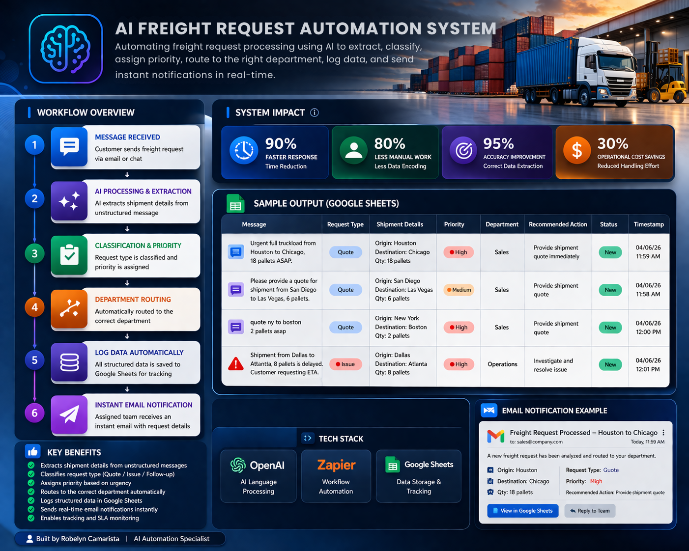

# 🚀 AI Freight Request Automation System

---

## 💡 Overview
## 🎯 What This Solves

This system removes the need for manual processing of freight requests by automatically extracting, classifying, and routing customer messages.

It helps logistics teams respond faster and operate more efficiently.

---

## 💼 Problem
Freight companies receive many customer requests via email or chat.

These messages are:
- Unstructured
- Time-consuming to process
- Prone to human error

Staff must manually read, classify, and encode each request.

---

## ✅ Solution
This system automates the entire workflow using AI and Zapier.

It transforms raw customer messages into structured, actionable data in real time.

---

## ⚙️ Workflow

1. Customer submits freight request (Google Sheets / Email)
2. AI extracts:
   - Origin
   - Destination
   - Quantity
3. AI classifies request:
   - Quote
   - Follow-up
   - Issue
4. System assigns priority:
   - High (ASAP / urgent)
   - Medium (default)
5. Automatically routes to:
   - Sales
   - Operations
6. Generates recommended action
7. Logs everything into Google Sheets
8. Sends email notification

---

## 💡 Key Features

- 🤖 AI-powered data extraction
- 📊 Automatic request classification
- ⚡ Priority detection (ASAP = High)
- 🧭 Smart department routing
- 📩 Automated email notifications
- 📁 Real-time logging in Google Sheets
- 🚫 Duplicate prevention using filters

---

## 🛠️ Tech Stack

- Zapier (Workflow Automation)
- OpenAI (AI Processing)
- Google Sheets (Data Storage)

---

## 📊 Sample Output

| Message | Request Type | Priority | Department |
|--------|-------------|----------|------------|
| Urgent shipment from Chicago to Houston | Quote | High | Sales |
| Follow-up on shipment from Seattle | Follow-up | Medium | Sales |
| Shipment delay issue from Dallas | Issue | High | Operations |

---

## 📈 Business Impact

- ⏱️ Faster response time
- 📉 Reduced manual work
- 🎯 Improved accuracy
- 🔄 Streamlined operations
- 💰 Increased efficiency

---

## 👤 Author

**Robelyn Joy Camarista**  
AI Automation Specialist

---

## 🔥 Note

This project is built for portfolio demonstration and showcases real-world AI automation for logistics workflows.
